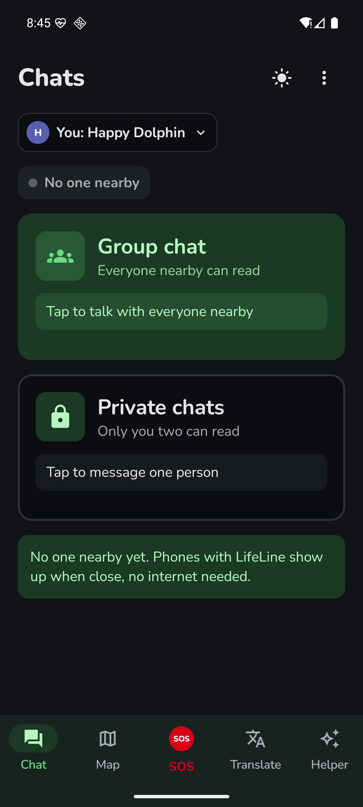
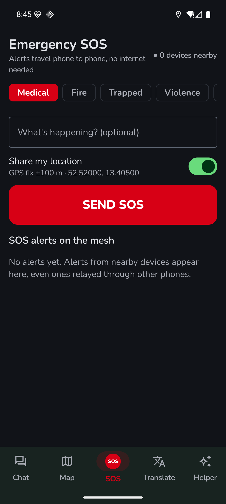
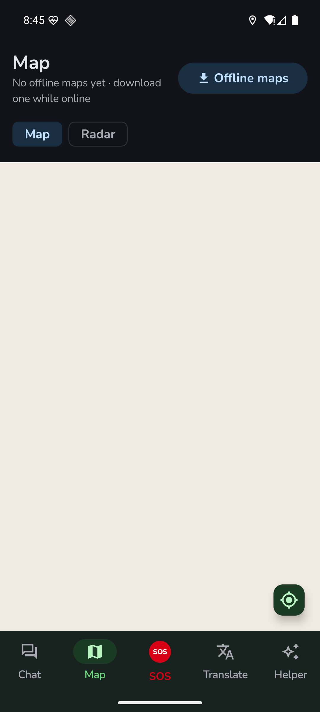
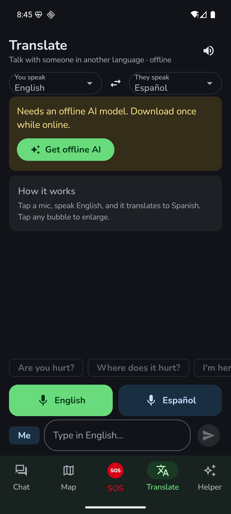
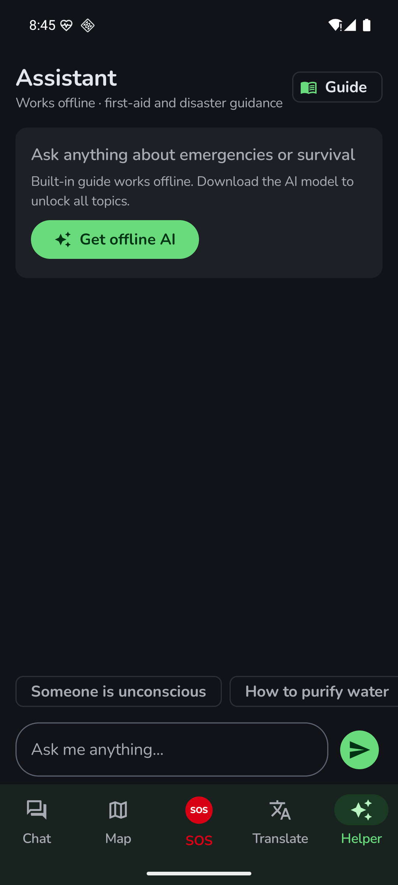

<div align="center">

# LifeLine

### Communication when infrastructure disappears.

**No internet. No SIM. No cell tower. Just LifeLine.**

[](https://github.com/code-ek/LifeLine/releases/download/v1.0.0/LifeLine.apk)
[](LICENSE)
[](https://developer.android.com)

---

### Watch the Trailer

https://github.com/code-ek/LifeLine/raw/main/assets/trailer.mp4

**[Watch in full HD on YouTube](https://youtu.be/X5PIhO-vDT0)**

---

</div>

## Screenshots

<div align="center">
<table>
<tr>
<td align="center"><b>Mesh Chat</b></td>
<td align="center"><b>Emergency SOS</b></td>
<td align="center"><b>Offline Map</b></td>
</tr>
<tr>
<td></td>
<td></td>
<td></td>
</tr>
<tr>
<td align="center"><b>Live Translation</b></td>
<td align="center"><b>AI Assistant</b></td>
<td></td>
</tr>
<tr>
<td></td>
<td></td>
<td></td>
</tr>
</table>
</div>

## The Problem

When disaster strikes — an earthquake, a hurricane, a conflict, an infrastructure collapse — conventional communication is often the first thing to fail. Cell towers go down. Internet disappears. Power grids fail.

People are left unable to call for help, find their families, or coordinate rescue.

**LifeLine exists because communication should not depend on infrastructure that can disappear.**

## The Solution

LifeLine turns nearby phones into a decentralized communication network using **Bluetooth Low Energy**. Phones talk directly to each other and relay messages onward — so your message can reach people far beyond a single connection's range.

```
Phone A  →  Phone B  →  Phone C  →  Phone D
```

Every phone becomes a relay. The more people who have LifeLine, the further messages can travel. No servers. No cloud. No internet required.

## Features

### Mesh Chat
Send messages to anyone on the mesh. Group chat broadcasts to everyone nearby. Private chats are end-to-end encrypted. Messages hop phone-to-phone to extend range.

### Emergency SOS
One-tap emergency alerts with GPS coordinates. Categorized by type — Medical, Fire, Trapped, Violence. Alerts propagate across the entire mesh automatically, reaching people you couldn't reach alone.

### Offline Maps
Download maps while you have internet. Navigate and locate other mesh users when connectivity is gone.

### Live Translation
Real-time offline translation between languages. Speak into your phone, the other person hears it in theirs. When a disaster crosses borders, language shouldn't be the reason someone doesn't get help.

### AI Assistant
On-device AI providing first-aid guidance, survival instructions, and emotional support — completely offline. Ask *"Someone is unconscious, what do I do?"* and get actionable medical guidance immediately.

## How It Works

LifeLine's mesh networking layer uses **Bluetooth Low Energy** to create a decentralized network between Android devices.

- **Peer Discovery** — BLE advertising and scanning to find nearby devices
- **Multi-Hop Relay** — Messages travel through intermediate devices to extend range
- **Store-and-Forward** — Devices hold messages for peers not currently reachable
- **Deduplication** — Prevents broadcast storms as messages propagate
- **Fragmentation** — Large messages split to fit BLE limits, reassembled on arrival

### Security

Privacy is not optional in emergencies — it's critical.

- **End-to-end encryption** using X25519 key exchange + AES-GCM
- **Device identity** via Ed25519 keypairs
- **QR code pairing** for secure private channels — no server or certificate authority needed

### On-Device Intelligence

- **AI Assistant** powered by MediaPipe with Gemma LLM — runs entirely on-device
- **Translation** via ML Kit with downloadable offline language packs
- **Speech recognition and TTS** for hands-free operation
- **First-aid knowledge base** as instant fallback while the LLM loads

## Tech Stack

| Layer | Technology |
|-------|-----------|
| Language | Kotlin |
| UI | Jetpack Compose |
| Networking | Bluetooth Low Energy (GATT) |
| Cryptography | Bouncy Castle, X25519, AES-GCM, Ed25519 |
| AI | MediaPipe, Gemma |
| Translation | ML Kit |
| Maps | MapLibre |
| QR Codes | ZXing, ML Kit Barcode |
| Camera | Android CameraX |

## Getting Started

### Prerequisites

- Android 8.0 (API 26) or higher
- Bluetooth Low Energy support
- Location permission (required for BLE scanning)

### Install

**Option 1:** Download the APK directly

[](https://github.com/code-ek/LifeLine/releases/download/v1.0.0/LifeLine.apk)

**Option 2:** Build from source

```bash
git clone https://github.com/code-ek/LifeLine.git
cd LifeLine
./gradlew assembleDebug
```

The APK will be at `app/build/outputs/apk/debug/`

### First Launch

1. Open LifeLine and grant Bluetooth + Location permissions
2. Your device automatically starts discovering nearby LifeLine users
3. Use **Chat** to message, **SOS** for emergencies, **Map** for navigation, **Translate** for language barriers, **Helper** for AI guidance
4. While you still have internet: download offline maps and translation language packs for your region

## Why LifeLine Exists

LifeLine isn't designed for one specific emergency. It's designed for the pattern that keeps repeating:

- Natural disasters
- Search and rescue operations
- Remote expeditions
- Communications blackouts
- Humanitarian crises
- Conflict zones where infrastructure has been destroyed

The situation changes every time, but the problem is always the same: **people need to communicate, and the systems they depend on aren't there.**

## Roadmap

- **iOS version** — more phones on the mesh means messages travel further
- **Wi-Fi Direct** alongside Bluetooth for greater range and bandwidth
- **Voice and image relay** across the mesh
- **Emergency service integration** — queued SOS alerts auto-forward when any mesh node reconnects
- **Play Store and App Store** distribution
- **Dedicated website** for documentation and community

## Open Source, Forever

LifeLine is and will remain **free and open source**. No paywalls. No subscriptions. No premium tiers.

Emergency communication is not a product — it's a right.

The full source code is publicly available so anyone, anywhere, can use it, audit it, improve it, and build on it.

## Contributing

Contributions are welcome. Whether it's bug fixes, new features, translations, or documentation — every contribution helps make emergency communication more accessible.

1. Fork the repository
2. Create your feature branch (`git checkout -b feature/your-feature`)
3. Commit your changes
4. Push to the branch
5. Open a Pull Request

---

<div align="center">

**If LifeLine ever helps even one person get the help they need, then building it was worth it.**

*Built at [Hack Atlantic 2026](https://hack-atlantic.devpost.com/)*

</div>
